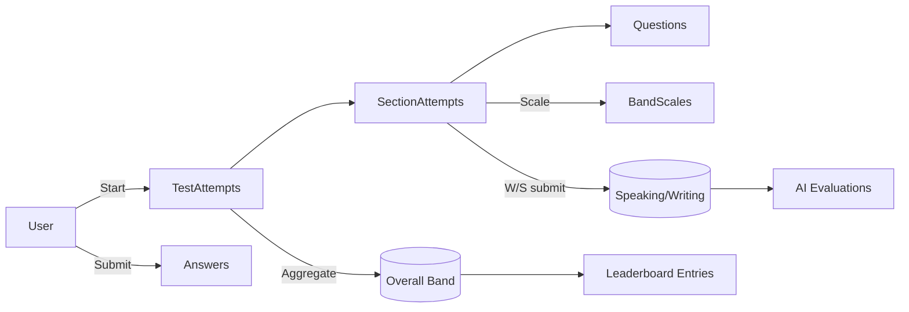

# Edumination

[](https://dotnet.microsoft.com/)
[](https://www.mysql.com/)
[](https://docs.docker.com/compose/)
[](#license)

**Edumination** is a learning & IELTS practice platform: test library, test-taking, auto/AI scoring, EDU-domain leaderboard, and content/admin tooling.

**▶ Figma (UI/UX):** https://www.figma.com/design/9oV8YQ7Bc5iJX2oM3KTvHU/Edumination?node-id=0-1&p=f&t=zLqWGpxYbCjRpmZt-0

---

## Table of Contents
- [Architecture & Structure](#architecture--structure)
- [Features](#features)
- [Tech Stack](#tech-stack)
- [Quick Start (Docker)](#quick-start-docker)
- [Local Development](#local-development)
- [Configuration & Environment Variables](#configuration--environment-variables)
- [Database Schema](#database-schema)
- [Key APIs](#key-apis)
- [Leaderboard (Ranking Rules)](#leaderboard-ranking-rules)
- [Security](#security)
- [Roadmap](#roadmap)
- [Contributing](#contributing)
- [License](#license)

---

## Architecture & Structure

Monorepo including Backend (.NET), Frontend (React), DB scripts, Nginx & Docker Compose.

```

Edumination/
├─ Backend/                # ASP.NET Core Web API
│  └─ src/Edumination.Api  # main project
├─ Frontend/               # React/TypeScript (WIP)
├─ db/init/                # SQL bootstrap + seed
├─ docker-compose.yml      # api + mysql + nginx
├─ nginx.conf              # reverse proxy
└─ README.md

````

---

## Features

- **Accounts & RBAC**
  - Email/password, email verification, password reset.
  - OAuth (Google) & account linking.
  - Multi-role per user: `STUDENT / TEACHER / ADMIN`.

- **IELTS Test Library**
  - Paper → Sections (Listening/Reading/Writing/Speaking) → Passages → Questions.
  - Question types: MCQ, Multi-Select, Fill-in-the-Blank, Matching, Ordering, Short Answer, Essay, Speak Prompt.
  - Band scale: convert raw → band per paper/skill.

- **Test-taking & Scoring**
  - Attempts & section attempts, answer persistence, automatic scoring for objective items.
  - Speaking/Writing: submit audio/text; AI-based scoring with Rubrics & Criteria.

- **EDU-domain Leaderboard**
  - Stores the “best attempt” per (user, paper); filter by email domain from `edu_domains`.

- **Courses & Band-based Recommendations**
  - Courses, Modules, Lessons; rules to map recommended courses by band ranges.

- **Content Review & Audit**
  - Review workflow (approve/reject) and audit logs for sensitive actions.

---

## Tech Stack

- **Backend:** ASP.NET Core 8, Entity Framework Core
- **Database:** MySQL 8 (InnoDB)
- **Frontend:** React + TypeScript (WIP)
- **Infra:** Docker Compose, Nginx reverse proxy

---

## Quick Start (Docker)

> Requirements: Docker Desktop/Engine + Compose.

```bash
git clone https://github.com/HoangDinhBui/Edumination
cd Edumination
docker compose up -d
# Logs
docker compose logs -f
````

* API via Nginx: `http://localhost:8080`
* MySQL: check credentials/ports in `docker-compose.yml`
* On first run, MySQL auto-loads scripts from `db/init/`.

---

## Local Development

### Backend

```bash
cd Backend/src/Edumination.Api
dotnet restore
dotnet run
```

### Frontend

```bash
cd Frontend
npm install
npm run dev
# set VITE_API_BASE_URL to the API endpoint
```

---

## Configuration & Environment Variables

Example `appsettings.Development.json`:

```json
{
  "ConnectionStrings": {
    "Default": "Server=localhost;Port=3306;Database=english_learning;User Id=appuser;Password=appsecret;SslMode=None;"
  },
  "Jwt": {
    "Issuer": "https://edumination.local",
    "Audience": "edumination-client",
    "Key": "your-very-long-secret-key"
  },
  "OAuth": {
    "Google": {
      "ClientId": "xxx.apps.googleusercontent.com",
      "ClientSecret": "yyy",
      "RedirectUri": "http://localhost:8080/api/v1/auth/oauth/google/callback"
    }
  }
}
```

Container env equivalents:

* `ConnectionStrings__Default`
* `Jwt__Issuer`, `Jwt__Audience`, `Jwt__Key`
* `OAuth__Google__ClientId`, `OAuth__Google__ClientSecret`, `OAuth__Google__RedirectUri`

---

## Database Schema

Main groups (condensed):

* **Identity & RBAC:** `users`, `roles`, `user_roles`, `user_profiles`, `oauth_providers`, `oauth_accounts`, `email_verifications`, `password_resets`
* **Media:** `assets`
* **IELTS Library:** `test_papers`, `test_sections`, `passages`, `questions`, `question_choices`, `question_answer_keys`, `band_scales`
* **Test-taking:** `test_attempts`, `section_attempts`, `answers`, `speaking_submissions`, `writing_submissions`
* **AI Scoring:** `ai_models`, `rubrics`, `rubric_criteria`, `ai_evaluations`, `ai_evaluation_details`
* **Leaderboard & Stats:** `edu_domains`, `v_users_edu`, `leaderboard_entries`, `user_stats`
* **Review & Audit:** `content_reviews`, `audit_logs`

<details>
<summary>Mermaid – Test flow (condensed)</summary>



</details>

---

## Key APIs

> Example base path: `/api/v1`

### Auth & User

* `POST /auth/login`
* `POST /auth/oauth/{provider}/callback`
* `GET /me`

### User Administration (ADMIN)

* `GET /admin/users?email=&role=&active=&page=&pageSize=`
* `POST /admin/users`
* `PATCH /admin/users/{id}`
* `POST /admin/users/{id}/roles`

**Payload – SetUserRoles**

```json
{
  "roles": ["ADMIN","TEACHER"],
  "mode": "Replace",
  "allowEmptyWhenReplace": false
}
```

### Tests & Attempts

* `GET /papers` → list of papers (only `PUBLISHED`)
* `GET /papers/{id}/sections`
* `POST /attempts` → start an attempt
* `POST /attempts/{id}/sections/{sectionId}/submit`
* `GET /attempts/{id}` → results & bands

### Leaderboard

* `GET /leaderboard?paperId=&domain=&from=&to=&q=&sort=&page=&pageSize=`

---

## Leaderboard (Ranking Rules)

* Source: `leaderboard_entries` keeps **best\_overall\_band** per (user, paper).
* EDU-only: show users whose email domain is listed in `edu_domains`.
* Sorting: `best_overall_band` **DESC** → `best_at` **ASC** (tie-break).
* Optionally include `user_stats` to render “My Rank” & skill overview.

---

## Security

* Strong JWT secret & periodic rotation.
* Use `JsonStringEnumConverter` to read/write enums as strings (clean API).
* Enforce `UNIQUE(user_id, role_id)` on `user_roles`.
* Guard against “remove all roles” for critical accounts (e.g., last admin).
* Log sensitive actions to `audit_logs`.

---

## Roadmap

* [ ] Complete Frontend (auth, test-taking, ranking).
* [ ] Ranking page with Paper/Domain/Time filters + My Rank + CSV export.
* [ ] Course recommendation by band.
* [ ] OpenAPI/Swagger & unit/integration tests.
* [ ] Basic CI/CD.

---

## Contributing

1. Fork & create a branch: `feature/your-feature`
2. Conventional commits: `feat: …`, `fix: …`
3. Open a Pull Request with clear description.

---
